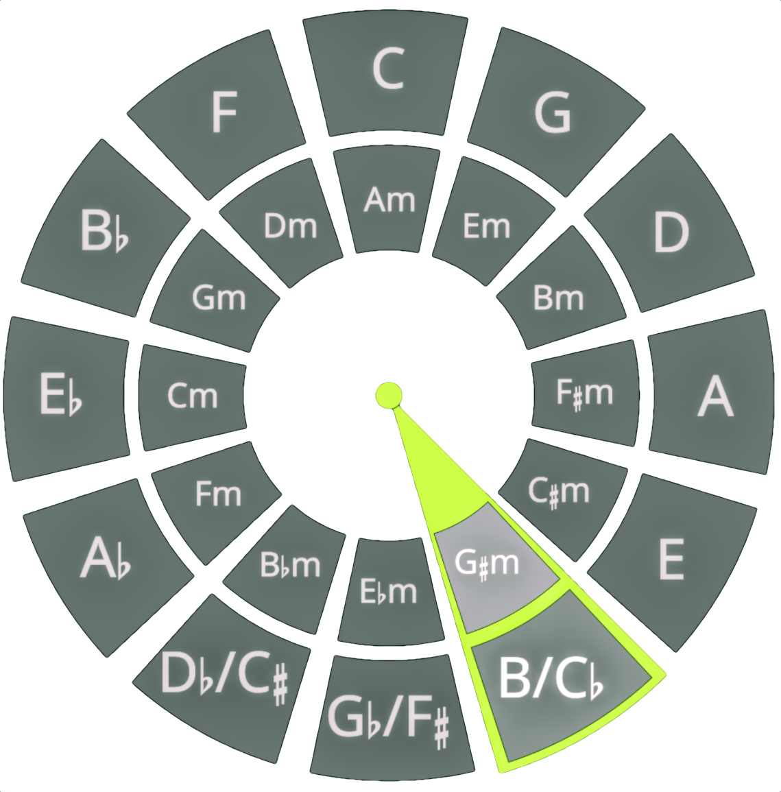

# Circle

Circle is an audio plugin for exploring the mystery and magic of the Circle of Fifths.

Circle is made and distributed by jodoko@ovolovo.com.

## Description

## Installation

You can download the latest release [here](https://github.com/jodoko/Circle).
Circle is available for macOS as an AU component.

## License

Circle is licensed under the General Public License agreement.
